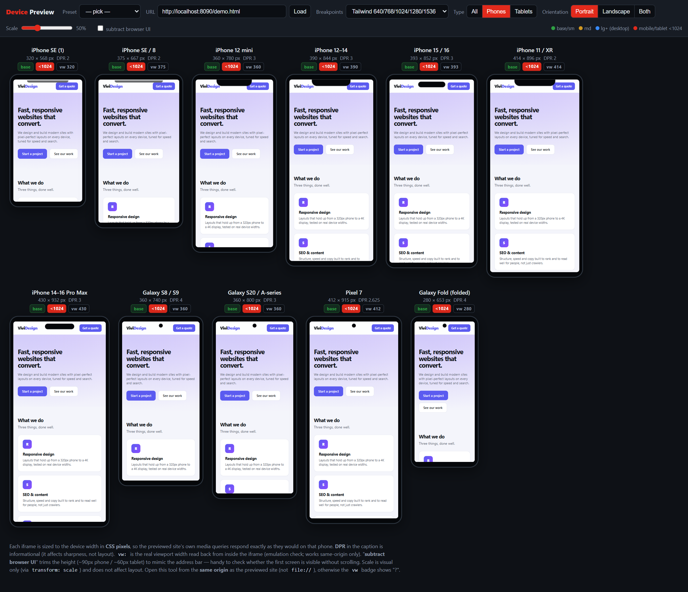

# Device Preview

A single-file, zero-dependency tool to preview any local URL across **18 real device viewports at once**, in **true CSS pixels** — so the previewed site's own media queries respond exactly as they would on a real phone or tablet.

No build step, no npm install, no Electron. Just one `index.html` you open in a browser.

## Why

Browser devtools show one viewport at a time. When you tweak a breakpoint you constantly resize and re-check each width. This tool lays out **all the common phones and tablets side by side**, each iframe sized to that device's CSS-pixel width, and tags every frame with the **breakpoint it currently lands in** (Tailwind or Bootstrap). You see, in one glance, where your layout changes and where it breaks.

## Features

- **18 devices** out of the box: 11 phones (iPhone SE → 16 Pro Max, Galaxy, Pixel, Fold) and 7 tablets (iPad mini → Pro 12.9", Galaxy Tab, Surface).
- **True CSS-px iframes** — media queries inside the previewed site react to the device width, not to a scaled screenshot.
- **Breakpoint badges** per device: switch between **Tailwind** (640/768/1024/1280/1536) and **Bootstrap** (576/768/992/1200/1400) sets, or edit your own in one array.
- **Orientation**: portrait, landscape, or both at once.
- **`vw` read-back**: reads the real `window.innerWidth` from inside each iframe (same-origin) so you can verify the emulation is honest.
- **"Subtract browser UI"**: trims ~90px (phone) / ~60px (tablet) to mimic the mobile address bar and check if the first screen fits without scrolling.
- **Visual scale** slider (does not affect layout — `transform: scale` only).
- **Notch / island / punch-hole** cosmetic frames per device.
- **Presets + URL bar** to jump between local servers.

## Usage

1. Serve the previewed site locally (any dev server).
2. Serve `index.html` from the **same origin** as that site (so the `vw` read-back works), e.g. drop it into your project's public/static folder, or run a small static server in this folder.
3. Open it, type the URL (or pick a preset), and review every device.

> Open it over `http://…`, not `file://`. If `index.html` and the previewed site are on **different origins**, the layout still renders but the `vw` badge shows `?` (browsers block cross-origin viewport reads — expected).

## Customizing

- **Devices**: edit the `DEVICES` array (`name, width, height, dpr, type, notch`).
- **Breakpoints**: edit the `BP` object to match your framework or design system.
- **Presets**: edit the `<select id="preset">` options with your own dev URLs.

## Install

There is nothing to install. Download `index.html` (or this repo) and open it. It's plain HTML/CSS/JS, ~280 lines, no dependencies.

## License

[MIT](LICENSE) © 2026 ViviDesign
